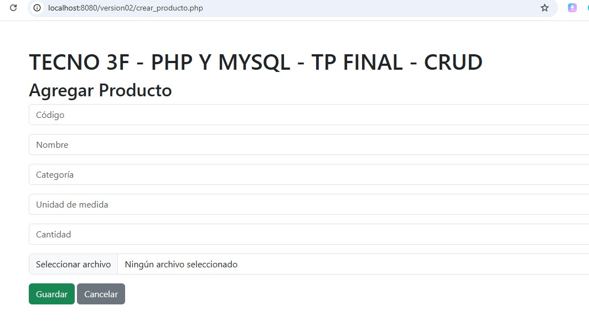

#  CURSO PHP Y MYSQL
## ALUMNO : SPECTERMAN LUIS OMAR

### TP FINAL Curso PHP y MYSQL de TECNO 3F 

### Consigna
Deberan crear un CRUD con LOGIN.
Deben realizar buenas practicas, indentando y comentando el
codigo¡

### 🔧 Tecnologías Usadas

- 🐘 PHP 
- 🐬 MySQL
- 🧰 Bootstrap 5
- 💾 XAMPP 
- 💻 Git & GitHub

---


#### Estructura de directorios
``` tree
    ├── uploads     ( carpeta donde se almacenan las imagenes de los productos que se cargan )
    │   Archivos para el crud   
    ├── conexion.php               conexion a la base de datos
    ├── crear_producto.php         creacion de producto , solicita datos e imagen opcional
    ├── dashboard.php              menu principal del crud
    ├── editar_producto.php        edicion de producto para modificar 
    ├── eliminar_producto.php      eliminar producto de la base de datos 
    ├── login.php                  solicitud usuario y clave para ingreso al crud
    ├── logout.php                 desconexion del crud
    ├── ver_productos.php          visualizar grilla productos cargados - opciones de editar y eliminar  
    ├   Archivos front basico para verificar funcionamiento del crud
    ├── catalogo.html              pagina html a manera de front basico - visualzar productos de la tabla usada en el crud tipo catalogo con cards por producto
    ├── api_productos.php          se usa en catalogo.html para conectar y traer los datos de base de datos que se procesan con javascript en catalogo.html
    ├── tp_final.sql               script para crear la base de datos y cargar dato usuario prueba
    └── README.md
```

---
### ATENCION Datos de prueba para validar el login al crud
  - #### Usuario de prueba        = admin
  - #### Clave Usuario de prueba  = admin123

### SERVIDOR USADO PARA ALOJAR EL TP
https://infinityfree.net/ 

### INICIAR CRUD desde servidor donde esta alojado   
http://los1062.rf.gd/login.php

### INICIAR FRONT desde servidor donde esta alojado  
http://los1062.rf.gd/catalogo.html

## 📦 Estructura de la base de datos

La estructura de la base de datos necesaria para este proyecto se encuentra en el siguiente archivo:

📁 [`tp_final.sql`](tp_final.sql)

Este archivo incluye las sentencias `CREATE DATABASE` y`CREATE TABLE`  demás instrucciones necesarias para generar la base de datos desde cero.

## 🧱 Ejemplo de estructura

```sql
DROP DATABASE IF EXISTS phpcrud3f;

CREATE DATABASE  phpcrud3f ;

USE phpcrud3f;

CREATE TABLE usuarios (
  id INT AUTO_INCREMENT PRIMARY KEY,
  usuario VARCHAR(50) UNIQUE,
  clave VARCHAR(255)
);

INSERT INTO usuarios (id, usuario, clave) VALUES
(2, 'admin', '$2y$10$JZ563bJy2jApeI98yskAFe6k16ew5BU4RwopJsJfPLn08XPKSxIru');


CREATE TABLE productos (
  id INT AUTO_INCREMENT PRIMARY KEY,
  codigo VARCHAR(50) UNIQUE,
  nombre VARCHAR(100),
  categoria VARCHAR(50),
  unidad_medida VARCHAR(20),
  cantidad INT,
  imagen VARCHAR(255)
);
```
## Pantallas del CRUD
### Pantalla login


### Pantalla dashboard


### Pantalla grilla de productos


### Pantalla crear producto


### Pantalla borrar producto


### Pantalla edicion para modificacion


## Pantallas del FRONT 
### Pantalla catalogo


